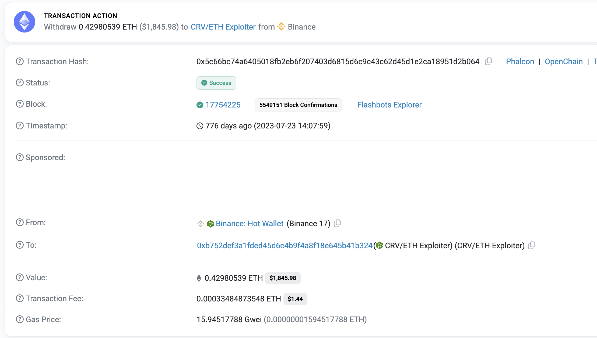
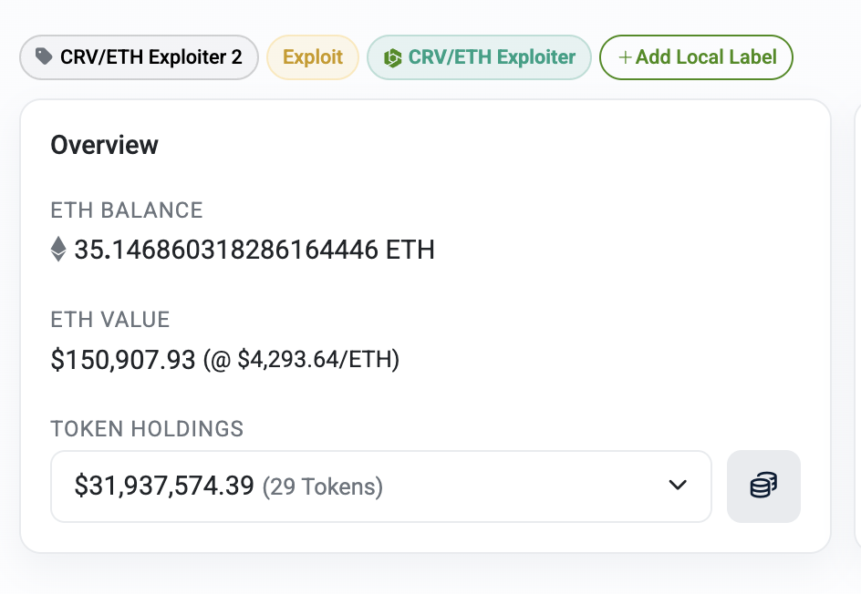
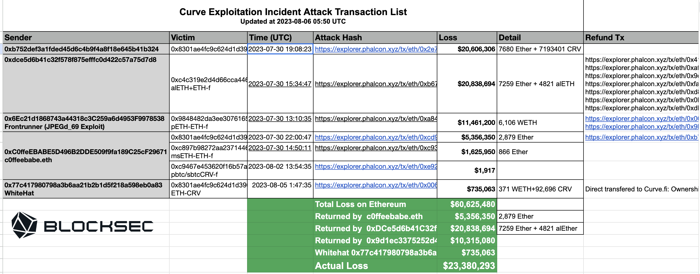
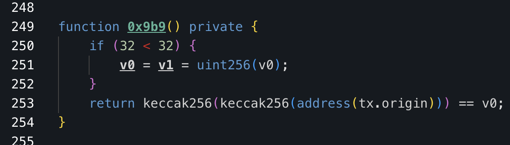

# Rabbithole
## Task

It turns out that Vyper has a bug, and some of the Curve pools were vulnerable, so you observed how, despite whitehat efforts, three different pools were drained. A few days later, you found that exploiters returned funds for two of them, but what about the ["CRV/ETH one"](https://etherscan.io/address/0xb752def3a1fded45d6c4b9f4a8f18e645b41b324)? You have reasons to believe that this exploiter is responsible for some of the other DeFi exploits that have occurred in the same year.

Please provide at least two examples (with different exploiter EOAs) of the previous exploits with Etherscan links and the reasoning that proves connections (some high-level details about the methodology could be helpful for solidifying proofs as well). You can’t use any data after 5th August, 2023 to prove your points.

## Solution

### Initial Analysis of CRV/ETH Exploiter

To find other attacker wallets, I researched behavior patterns and unique markers that differentiate this exploiter from other hackers.

**Key points for hacker activities:**
- Deposit address (ETH needed for gas fees)
- Exploit execution (the most important indicator)
- Withdrawal address
- Transaction behavior patterns

#### Deposit

The initial deposit came from Binance, likely to bypass security monitoring since Binance deposits are typically considered safe. While monitoring systems focus on Tornado Cash, Railgun, FixedFloat, and other mixers, the attacker probably used fake KYC documents to fund through Binance.

#### Withdrawal

Stolen funds moved to ["CRV/ETH Exploiter 2"](https://etherscan.io/address/0xc772bdb4588414d8401ab90aa9da084eb52e7475), but only 1,500 ETH went through Tornado Cash. The remaining stolen funds still sit in the wallet for unknown reasons.

#### Activity Before the Hack

This account was initially created to attack the MiningRig contract. The attacker began preparing on July 28 but was too slow. [c0ffeebabe.eth](https://x.com/0xjustadev/status/1685277465483026432) exploited it first on July 29 (potentially frontrunning other hackers). This suggests the CRV/ETH exploiter was trying to exploit an already known vulnerability.

The CRV/ETH Exploiter drained what remained, obtaining 32.291419732496523585 ETH (~$60K at that time) - modest profit for a hacking operation.
[Transaction example](https://etherscan.io/tx/0x756cf2da292c3511735ee67e566bbf8209990724949852b2ee582a332e725b27)

#### The Hack Itself

The attacker didn't discover the Vyper vulnerability independently. At least 5 different actors had already exploited it, with Twitter buzzing about the bug. The CRV/ETH Exploiter simply wrote his own exploit for this known vulnerability.

[Timeline spreadsheet](https://docs.google.com/spreadsheets/d/1gUi7Nxs6V4wHKUMfSq85d2ShFW3fsMfggKIEV846ROQ/edit?gid=0#gid=0)

Once the Vyper reentrancy vulnerability went public, every second counted. The attacker likely reused this wallet for the CRV/ETH attack to save time on anonymous deposits.

#### Exploit Techniques

Each exploit contract used the same unique obfuscation: double keccak256 hashing with bytes manipulation for owner checks, preventing MEV bots from frontrunning the exploit. 

### Attacker Markers

After the review, I identified the following attacker markers:

- **Double keccak256** (most unique identifier)
- **Binance deposits** for funding
- **Multiple hacks** from the same wallet
- **Delayed withdrawals** via separate wallets
- **Targets small projects** without audits
- **Accepts small profits** (<$100k per hack)
- **Drains leftover funds** from other hackers' exploits

## Hack Research

I reviewed Ethereum Q1-Q2 2023 hacks using the [BlockThreat newsletter archive](https://newsletter.blockthreat.io/archive). After several hours of research, I discovered that double keccak check is incredibly unique - it appears almost exclusively in wallets with similar attacker markers.

I identified 7 accounts with very similar characteristics.

**Note**: I define malicious wallet activity as exploit creation and execution transactions only. Swaps and withdrawals are excluded since attackers often wait extended periods before moving funds.

## Case #1

**Attacker EOA**: [`0xceed34f03a3e607cc04c2d0441c7386b190d7cf4`](https://etherscan.io/address/0xceed34f03a3e607cc04c2d0441c7386b190d7cf4)  
**Activity Period**: 2022-11-04 to 2023-01-26

### Shared Characteristics with CRV/ETH Exploiter

- **Binance funding**
- **Double keccak checks in exploit** (without bytes manipulation - likely improved in later attacks as this was deployed end of 2022)
- **Funds partially remain in exploit contracts**
- **Multiple hacks from the same address**
- **Targets low-cap tokens**

### Attack Examples

The attacks included manipulation of different token pairs ($CANDLE, $BCI, $RINU). This account has an extensive history with many hacked protocols:

- **ElasticSwap**: [0x23bc33d17cb268a7588a9c0dde9127705b464b7c12a44b5ca41fa911bc26d583](https://etherscan.io/tx/0x23bc33d17cb268a7588a9c0dde9127705b464b7c12a44b5ca41fa911bc26d583)
- **$CANDLE, $BCI, $RINU manipulations**: [BlockSec analysis](https://x.com/blocksecteam/status/1618572725643276288)
- **Convex locks stealing**: [0xdb0ec2d6ddef41f599b804e6022a4b6eea6ba6cf3a919dc880a7472be2e1d58c](https://etherscan.io/tx/0xdb0ec2d6ddef41f599b804e6022a4b6eea6ba6cf3a919dc880a7472be2e1d58c)
- **UPS token skim() attack**: [0x4b3df6e9c68ae482c71a02832f7f599ff58ff877ec05fed0abd95b31d2d7d912](https://etherscan.io/tx/0x4b3df6e9c68ae482c71a02832f7f599ff58ff877ec05fed0abd95b31d2d7d912)

### Additional Behavioral Insights

This wallet's activity confirmed my initial markers and revealed new patterns:

- **Confirmed**: Same account used for multiple hacks over extended periods
- **Confirmed**: Targets any vulnerable protocol, regardless of potential profit (some yielded <$100)
- **New marker**: Never uses self-destructing contracts, despite their popularity at the time

## Case #2

**Attacker EOA**: [`0xdbdf5f801da11d65fe9b1d449cbed6ebe2f04fd3`](https://etherscan.io/address/0xdbdf5f801da11d65fe9b1d449cbed6ebe2f04fd3)  
**Activity Period**: 2023-04-09 to 2023-04-24

### Shared Characteristics with CRV/ETH Exploiter

- **Binance funding**
- **Double keccak checks in exploit**
- **Multiple hacks from the same address**
- **Withdrawal via Tornado Cash**
- **Targets low-cap tokens**

### Attack Examples
- **Swapos hack**: [0x87a34e9d1d991c6747242fc64f25be05da68522aa14aaffdcbb44dc78b66c50c](https://etherscan.io/tx/0x87a34e9d1d991c6747242fc64f25be05da68522aa14aaffdcbb44dc78b66c50c)
- **DefiGreek hack**: [0xa32c84ad09369880dfbdf01bcacc2de632ab8c49d97c33ef695fd0d344955b3d](https://etherscan.io/tx/0xa32c84ad09369880dfbdf01bcacc2de632ab8c49d97c33ef695fd0d344955b3d)

## Case #3

**Attacker EOA**: [`0x3bfe2a46f0050c76ea95b65abfa826bbfb27596d`](https://etherscan.io/address/0x3bfe2a46f0050c76ea95b65abfa826bbfb27596d)  
**Activity Period**: 2023-04-27 to 2023-04-28

### Shared Characteristics with CRV/ETH Exploiter

- **Binance funding**
- **Double keccak checks in exploit**
- **Funds partially remain in exploit contracts**
- **Exploits vulnerabilities after other hackers**
- **Targets low-cap tokens**

### Attack Examples

- **Fortube hack**: [Transaction](https://etherscan.io/tx/0x082144b012cf4cb266569085829a12fa64fb3a4a9931289e930e14ead4a3737d)

## Case #4: Start of BSC Operations

**Attacker EOA**: [`0x2d2bcd3caed4b51b7090c78cfd73ea091a4b44de`](https://bscscan.com/address/0x2d2bcd3caed4b51b7090c78cfd73ea091a4b44de)  
**Activity Period**: 2023-04-03 to ~2023-05-06  
**Note**: Unlike mainnet operations, the attacker used Tornado Cash deposits on BSC instead of Binance across all identified wallets.

### Shared Characteristics with CRV/ETH Exploiter

- **Double keccak checks in exploit**
- **Multiple hacks from the same address**
- **Withdrawal via Tornado Cash**
- **Targets low-cap tokens**

### Attack Examples

- **FryingDutchManSailingBusd**: [Transaction](https://bscscan.com/tx/0x10f290b3f71a7ad0296d481c9ac0b63815a9609e60f79aa0b84d09ae2eda0118)
- **CHATGPT**: [Transaction](https://bscscan.com/tx/0xc944855bf9060ad4dc261d96ce66ea331b00bcc0ed89169542c1a2156c443e06)
- **Andre Anonymous (AA)**: [Transaction](https://bscscan.com/tx/0x7b41ed2db8606953984bb131ca103444037f82923fa2a8f7b9fc5627dffc5e0e)

## Case #5

**Attacker EOA**: [`0x054a3574d8082112575843dd944ff42c58dda38d`](https://bscscan.com/address/0x054a3574d8082112575843dd944ff42c58dda38d)  
**Activity Period**: 2023-05-21 to 2023-05-24

### Shared Characteristics with CRV/ETH Exploiter

- **Double keccak checks in exploit**
- **Multiple hacks from the same address**
- **Targets low-cap tokens**

### Attack Examples

- **GCCombinedSwap**: [Transaction](https://bscscan.com/tx/0x913b6313250675ef9fecefe371928bcc4be20ed234fae44e8e6bf409e9208e49)

## Case #6

**Attacker EOA**: [`0x0A3feE894eb8fCB6f84460d5828d71Be50612762`](https://bscscan.com/address/0x0A3feE894eb8fCB6f84460d5828d71Be50612762)  
**Activity Period**: 2023-05-28 to 2023-06-01

### Shared Characteristics with CRV/ETH Exploiter

- **Double keccak checks in exploit**
- **Multiple hacks from the same address**
- **Targets low-cap tokens**

### Attack Examples

- **Marketplace**: [Transaction](https://bscscan.com/tx/0xd92bf51b9bf464420e1261cfcd8b291ee05d5fbffbfbb316ec95131779f80809)

## Case #7

**Attacker EOA**: [`0x0060129430df7ea188be3d8818404a2d40896089`](https://bscscan.com/address/0x0060129430df7ea188be3d8818404a2d40896089)  
**Activity Period**: 2023-06-02 to 2023-06-10

### Shared Characteristics with CRV/ETH Exploiter

- **Double keccak checks in exploit**
- **Multiple hacks from the same address**
- **Targets low-cap tokens**

### Attack Examples

- **SELLC**: [Transaction](https://bscscan.com/tx/0xd91cf50e8c0d12f521dcfa909c0c139e007eb26cb0868b0a22b36532ececc192)

## Conclusion

The attacker demonstrated consistent behavior patterns across all cases:

- **Target selection**: Focus on low-security projects without audits
- **Profit tolerance**: Willing to exploit for minimal profits (<$100)
- **Attack type**: Primarily liquidity/reward manipulation attacks
- **Technical signature**: Unique double keccak256 owner check implementation
- **Wallet management**: Rotating hot wallets for multiple consecutive hacks
- **Account migration**: Clear chronological progression from one account to another
- **Withdrawal pattern**: Delayed withdrawals while continuing attacks from new wallets
- **Funding sources**:
  - Mainnet: Binance deposits (likely using fake KYC)
  - BSC: Tornado Cash deposits
