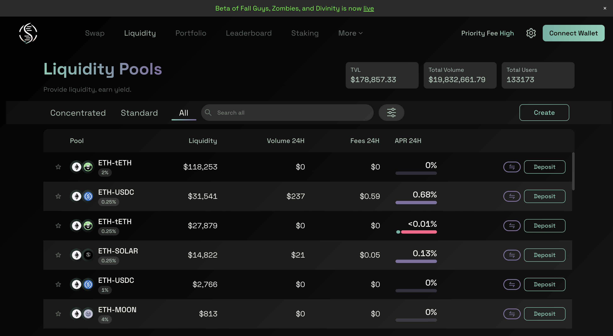

# Red Flags Everywhere

## Task

You were responsible for the tech due diligence of a new shiny Ethereum SVM L2, which just launched [testnet](https://github.com/Eclipse-Laboratories-Inc/dev-docs/tree/main/developers/rpc-and-block-explorers#eclipse-testnet). In the end, you passed on investing because of multiple red flags, but now you want to check how's it going.

1. Their testnet had no downtime, but was the blob posting on Celestia also consistent? If not, what were the gaps in posting?
2. For good or bad, this L2 went live. What were the top-5 activity sources for last month, and what's their economic sense?
3. Amongst whale depositors, you found one of the [market makers](https://etherscan.io/address/0x88cf132d5d46c390391344a1ec8bb98340d8a066). What do they do on the L2? Provide a few examples of DeFi positions they had there. Provide explorer links, if possible.

## Solution

### 1. Celestia Blob Posting Consistency

From the task description, I found Eclipse's [Celestia namespace](https://mocha-4.celenium.io/namespace/0000000000000000000000000000000000000000000065636c74330a?tab=Blobs).

With 105,000 blobs to analyze, I needed to download the entire dataset first. A quick dive into Celenium's documentation revealed the right API endpoint for bulk data extraction.

> **- Claude code, generate a Python script and download all blob data into a .json file using this API. Download in batches, save progress on each step.**
> 
> *- Here is your 85 MB JSON file!*
> 
> **- Now generate a Python script to calculate average time between blob postings using numpy and give me a report with the list of deviations and proofs. Use matplotlib to draw the gaps histogram. Make it beautiful.**

 

**Task #1 is completed.**

#### Analysis Results

| Gap Duration | Time Period | Description |
|-------------|-------------|-------------|
| **42.6 days** | Feb 25 - Apr 8, 2024 | Complete shutdown for 6 weeks |
| **23.9 days** | Dec 16, 2023 - Jan 9, 2024 | Probably went on holiday break? |
| **2.5 days** | Feb 17-20, 2024 | Short outage |
| **8.9 hours** | Dec 13-14, 2023 | Brief interruption |

**Summary**: The blockchain had no posted blobs for **77.9 days** during the testnet period, which represents **59.5%** of the entire testnet duration.

### 2. Blockchain Activity Analysis

Next, I needed to analyze blockchain data. Dune did not support queries on Eclipse, however there was another great instrument for this task: [Flipside MCP](https://docs.flipsidecrypto.xyz/welcome-to-flipside/flipside-growth-mcp)

> **- Claude code, using Flipside MCP generate for me a list of the top 6 most active programs in Eclipse for the last month.**

Obtained data:

| Rank | Program Address | Total Events | Unique TXs | Unique Users |
|------|----------------|--------------|------------|--------------|
| 1 | `ComputeBudget111111111111111111111111111111` | 8,751,908 | 5,403,041 | 39,504 |
| 2 | `FUCHhfHbuxXBWiRBfVdhmiog84sUJw11aAq3ibAUGL6e` | 4,345,052 | 2,172,526 | 1 |
| 3 | `F1ULBrY2Tjsmb1L4Wt4vX6UtiWRikLoRFWooSpxMM6nR` | 1,664,168 | 1,664,168 | 414 |
| 4 | `EorefDWqzJK31vLxaqkDGsx3CRKqPVpWfuJL7qBQMZYd` | 1,198,275 | 1,096,219 | 399 |
| 5 | `pythWSnswVUd12oZpeFP8e9CVaEqJg25g1Vtc2biRsT` | 553,750 | 553,750 | 96 |
| 6 | `5vuYxBvVVNcdw6Dkea79xDRpBi5Q4253vMMZdvUDoMpX` | 533,628 | 533,628 | 20 |

 
Let's review the results.

#### Obvious ones
- `ComputeBudget111111111111111111111111111111` - a standard Solana program.
- `pythWSnswVUd12oZpeFP8e9CVaEqJg25g1Vtc2biRsT` - a Pyth oracle.

#### Less obvious 
- `EorefDWqzJK31vLxaqkDGsx3CRKqPVpWfuJL7qBQMZYd` - BITZ Program
- `F1ULBrY2Tjsmb1L4Wt4vX6UtiWRikLoRFWooSpxMM6nR` - BITZ Noop Program
- `5vuYxBvVVNcdw6Dkea79xDRpBi5Q4253vMMZdvUDoMpX` - BITZ Mining Program

Google had no info about these programs, but GitHub search revealed the source:
 

**BITZ** is a fork of the [ORE](https://github.com/regolith-labs/ore/tree/master) project. BITZ tokens could be mined, generating significant on-chain noise similar to Ordinals tokens.

#### Not obvious at all
- `FUCHhfHbuxXBWiRBfVdhmiog84sUJw11aAq3ibAUGL6e`

This was the trickiest one. The #1 program on chain by activity. There was no info on GitHub, Google, Twitter, etc.

What the FUCH was this? 

I started reviewing transactions on EclipseScan. At first I thought this was a MEV bot, however its transactions did not have any balance changes or token transfers. Only strange instructions:

1. `setComputeUnitLimit` — sets how many compute units (resources) the transaction can use. (like gasLimit).

2. `setComputeUnitPrice` — sets the price per CU to increase priority. (like gasPrice).
3. ??
4. ??

Two instructions with unknown data were updating random looking accounts.

I tried to decompile the program and review it using my friend's [tool](https://github.com/Decurity/solana-ebpf-ida-processor). I quickly understood this was not the right approach.

I tried to review the account updates dynamically and understand what data was changed (I don't know why I thought this was a good idea)

I didn't understand anything, but it looked like an oracle.

Finally I asked myself the right questions.
- "How many accounts were updated by this program?"
- "Who else uses them?"

> **- Claude Code, using Flipside MCP give me the list of all accounts that were passed to program `FUCHhfHbuxXBWiRBfVdhmiog84sUJw11aAq3ibAUGL6e`**

**Writable accounts (3 pairs):**

| Pair | Activity % | Account 1 | Account 2 |
|------|-----------|-----------|----------|
| 1 | 61.79% | `CYESsyLqZb5qLxmBiRaMfJzWho9uaJtHZ99kGCg7Wf8K` | `BJYusw5QvkWGLTwsXuVwvkjZJcMDW8SKGengPcdcgJ1m` |
| 2 | 24.53% | `6Si5jzZCnZYzqU9ap8NGMjdar5z3stZJGoi7PRh7Z4hc` | `7YAFeKLJF1BQHwdXXMzPgjrHoHZewDK58QwcC7o5YYa` |
| 3 | 13.68% | `4bbK5m6YSPyALDa5uE9WYMLwnqEATHDzWdYqFZJ6Ezrf` | `E4wLiGrpMi2RtH7c1WrTzCdVVEi58za1XzPygtr7Kmz1` |

Interesting, only 6 accounts in total. More confidence that it is oracle.

> **- Claude code, who else uses these accounts?**

#### High-Volume Signers (1000+ transactions)

| Signer Address | Transaction Count | Latest Transaction Hash | Fee |
|---------------|------------------|------------------------|-----|
| `4bEk3CLwmnRHQxUEqDtNcXabz8RSdQyMpsAKJTaM8NUc` | 1,039,703 | `48pazBGykXLppjXRka1gJftr9asQGA4JrfufDsCyFbJ47jv2h8BqDhc7TLpufV6haXLo94P68n3YLqQ1szT6Sz6h` | 90 |
| `9rXhiXGzY4Jht77LAPTz2jYVwmsGVcA3e3Ur4U64hkYR` | 15,083 | `3zpYrM2R7GmRHnBBrRNJPeawwC6bcoxH6a9G1L9xBV6h14LzGhSMbpbdTQQ9T3FSv2W8eArC2jzSM1G9ZFnjQRfm` | 50 |

#### Medium-Volume Signers (10-100 transactions)

| Signer Address | Transaction Count | Latest Transaction Hash | Fee |
|---------------|------------------|------------------------|-----|
| `CCouRkoUhb3n6BwmSTJBV1AeGsjCoPVEZq2NWX8fEhz5` | 71 | `5ymsZ5wign5yyqhjWaDEFNwF8aL6GyipFBjSehSk3bZjbAbFZPJbH1etRfGUc6A2PMAMfA4KSh61MRL8LoLC6fs1` | 50 |
| `64zm1Wcxn4nV2jrCV4B6tFKwH8upBV49pACZAWwN32Bi` | 57 | `ksiFaZ9dBEd14HT3err4PemCx9VMJ1iQTJyRYFG5C4DaJ5rKZAnrGThc3WuEWPSep87GreDiHJmW3JNqtUxScPe` | 50 |
| `FhB5zMd8GhAqgvNtjb2F2QnfvYuqWEWSkJRVocuboDMd` | 45 | `5pRzrkT3Cd823WcbBNAJD4J3ytA3VKKzpGsHDSXUJnkpr4BjBdh53wivSQZ332VKC72UjLRoTmu4b2yJJTbKzW8T` | 50 |
| `27a2Ax36ALmWJs2coiKLSTHaj5ZDwe3ChGtRqPKMCDV1` | 42 | `4QqFQa88k9u4hjnfckDCTP2qcS3WeCEzwbqAucJH6nLbVgYQkVWQz6yg2bFwmXTFSQhkRfLhWun2RWi24fKXL9NJ` | 50 |

That's a lot of signers! I looked at the latest transactions to see what they were doing:

It was a swap transaction using an unknown program. The program was using those mystery accounts. But what was this program?

Everything pointed to Lifinity. After looking at their docs and how they work on Solana, it became clear - this was a [Lifinity oracle](https://docs.lifinity.io/dex/oracle). 

The same oracle they use on Solana: https://solscan.io/account/5uD7Z9p3iBznhR7xidhh91NUPUjak1LCxAMnjB5LsXdL.

**Task #2 is completed.**

### 3. Market Maker Wallet Activity

Now for the third task. I had the market maker's Ethereum address and needed to track down their Eclipse wallet.

The key was finding their bridge transactions:

#### Bridge Deposits Summary

| Bridge | Deposits | Total Amount |
|--------|----------|-------------|
| **Eclipse Canonical Bridge** | 13 | **574.48 ETH** |
| **Hyperlane Bridge** | 5 | **327.28 weETH** |

Every bridge deposit transaction ([example](https://etherscan.io/tx/0x53a49ffcbd9244dc738d3157541cbd0d358163c67aa3eabf4b597e7abeed04aa)), had the same recipient address in the calldata: `0xb5bafe14678cfd682d3b40d01a809b243b7544a3fa6975582ac2a5e3f4c59939`

Converting it to base58 format gave me the Solana address format.

The MM's Eclipse account: [`DEQAtFnQYmmVgguovNNpk6NCwiumdxxnJ1dmwWT8FgMN`](https://eclipsescan.xyz/account/DEQAtFnQYmmVgguovNNpk6NCwiumdxxnJ1dmwWT8FgMN)

#### Main Activities

Transaction history showed the wallet's main activity was providing liquidity across local DEXs:

- **Umbra.Finance**
- **Orca Whirlpools**  
- **Solar**
  

At first, everything looked normal. The market maker had one position in each DEX. But when I looked closer, the red flags started showing up.

#### 1. Umbra.Finance
- [ETH/weETH LP position](https://eclipsescan.xyz/token/CGB9SzevpWEdTMarmWaTygbrH23WtzZGjGYWGD9rX4jA) 

MM owned the entire ETH/weETH pool. This single pool made up 2/3 of Umbra's total value locked.

Hovewer the pool had zero trading volume. No fees. No activity. The protocol looked completely dead after Eclipse launch.

Update September 2025: Even their API stopped working. 

#### 2. Solar
- [ETH-tETH Position](https://eclipsescan.xyz/token/ExVXb4F3dZEzM8Ce7FLGWQdLh3oqxU7Fey1hRw3wTMs9)

Similar red flags. MM's single $120k position represented 65% of Solar's $186k total TVL. The position had no volume and no fees.

#### 3. Orca Whirlpools
- [ETH/SOL LP position](https://eclipsescan.xyz/token/3fQgVwgroksgmrbYUGYGe6x5nRBLQTuBQoYNivHGiLLQ)

This one looked better at first. The MM owned the entire $2M ETH/SOL pool, but at least Orca had $7M total value and some real trading.

The position made 1.7% returns. However, it did not seem profitable considering the impermanent loss. Even simple ETH staking would have been a better strategy. 

#### Summary

While the activity initially appeared as standard LP farming, deeper investigation revealed concerning patterns:

| Red Flag | Description |
|----------|-------------|
| **Monopolized Liquidity** | Market maker was the sole liquidity provider in multiple pools |
| **Zero Volume** | Minimal to zero trading volumes across most positions |
| **Poor Economics** | Returns didn't justify capital deployment or impermanent loss risks |
| **Abandoned Protocols** | Protocols appeared dead post-TGE |

This didn't look like genuine market making but rather artificial TVL inflation to make the Eclipse ecosystem appear more active than it actually was. 

---

*Research is done!*
