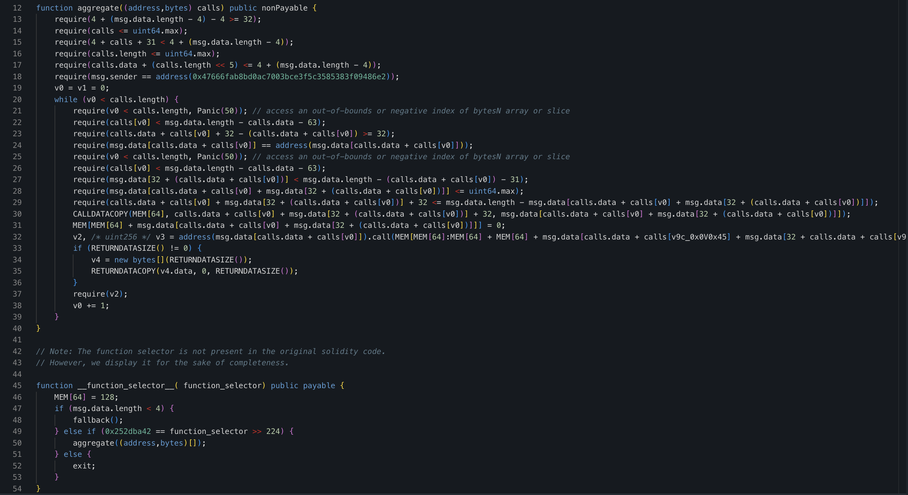

# What if
## Task
Imagine that one of the large stETH holders (["in an illegal way"](https://etherscan.io/tx/0xa284a1bc4c7e0379c924c73fcea1067068635507254b03ebbbd3f4e222c1fae0)) just sold tokens using only onchain AMM pools with horrible execution. All explorers are down, so you can’t easily find what pools are skewed at the moment (you can try Tenderly for a 25% score cut, though), but you’re sure it should be the largest ones, so feel free to check via RPC.

You don’t have any capital at the moment, but you think you can find a way to return at least 75M USDC to the victim (just hold funds in your wallet for the verification). Can you?

We ended with 85M USDC in this hardly imaginable situation, let us know if you beat it.

## Solution

To understand which pools were used by hacker, I first needed to analyze the attacker's transactions. I used Claude Code with access to Cast and Python, which together functioned as a text-based block explorer.

I gathered the following transaction information:

### Transaction 1 - Nonce 0
- **Type**: Contract Deployment
- **Deployed Contract**: `0x59e7c27f62d65c7126937168ba53410786ebc850`
- **Note**: Custom multicall contract that only accepts calls from the exploiter's EOA

### Transaction 2 - Nonce 1
- **Hash**: `0x7b62c28030a32e6746e1651b6c2e86ebc7d201f2df459027c57cac45cef36e49`
- **Block**: 21895254
- **Type**: stETH Transfer
- **From**: `0x47666fab8bd0ac7003bce3f5c3585383f09486e2`
- **To**: `0xae7ab96520DE3A18E5e111B5EaAb095312D7fE84` (stETH contract)
- **Method**: `transfer()`
- **Amount**: 90,375.547907685258392043 stETH
- **Effect**: Transferred stolen stETH from exploiter EOA to swap contract

### Transaction 3 - Nonce 2
- **Status**: Swap execution transaction
- **Note**: This transaction executed the actual swaps through the deployed contract

I fetched the deployed contract's bytecode and decompiled it using Dedaub. It contained a simple multicall function:

To understand what happened during the swap, I decoded the calldata from transaction #3. Claude Code generated an effective script for this purpose. The decoded results are available in `decoded_calldata.txt`.

The next steps were straightforward but required careful implementation. Since most of the exploited pools were severely imbalanced, I could generate significant profit by using flash loans to swap in the opposite direction. As there was no way to sell tokens on already imbalanced DEXes, I deposited them as collateral in both Aave V2 and V3 and lend USDC to solve the task.